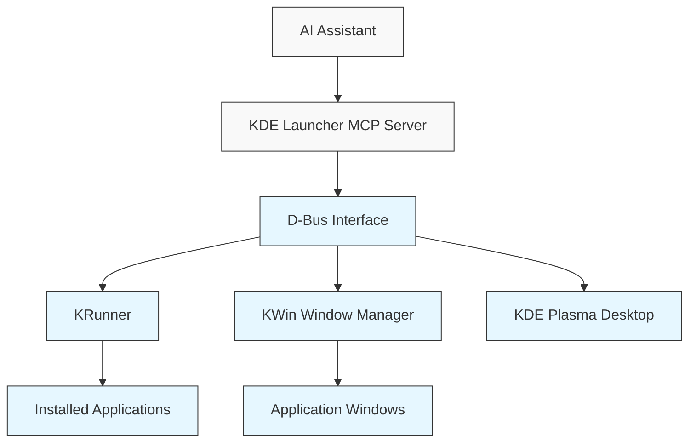

# KDE Desktop Application Launcher MCP Server

This MCP server provides tools for launching and managing applications on KDE Plasma desktop environments through AI assistants like Claude.

## Overview

The KDE Launcher server allows AI assistants to:

1. Search for installed applications
2. Launch applications with optional arguments
3. Query running applications
4. Focus, minimize, or close running applications
5. Create custom application launchers

## Architecture



## Components

### KDE Launcher Server

The server uses the FastMCP framework to expose KDE Plasma functionality to AI assistants through a standardized interface.

### D-Bus Integration

Communication with KDE's subsystems is handled through D-Bus, which provides a standardized way to interact with desktop services like:

- KRunner (application search and launch)
- KWin (window management)
- KDE Plasma desktop settings

## Tools

### 1. Search Applications

Find installed applications matching a query string.

```
search_applications(query: str) -> List[Dict[str, str]]
```

Returns a list of applications with name, description, and application ID.

### 2. Launch Application

Start an application with optional command-line arguments.

```
launch_application(app_id: str, args: Optional[List[str]] = None) -> Dict[str, Any]
```

Returns status and process information.

### 3. List Running Applications

Get information about currently running applications.

```
list_running_applications() -> List[Dict[str, Any]]
```

Returns a list of running applications with window IDs and titles.

### 4. Control Window

Control an application window (focus, minimize, maximize, close).

```
control_window(window_id: str, action: str) -> bool
```

Supported actions: "focus", "minimize", "maximize", "close"

### 5. Create Launcher

Create a custom application launcher for frequent use.

```
create_launcher(name: str, command: str, icon: Optional[str] = None, categories: Optional[List[str]] = None) -> bool
```

## Setup and Installation

### Prerequisites

- Linux with KDE Plasma desktop environment
- Python 3.9+
- KDE system libraries and D-Bus

### Installation

1. Install the required system packages:

```bash
sudo apt-get install python3-dbus python3-pyqt5 libqt5dbus5
```

2. Install the MCP server:

```bash
pip install mcp-servers
```

### Running the server

```bash
python -m src.kde-launcher.kde_launcher_server
```

Or using the installed script:

```bash
mcp-kde-launcher
```

## Security Considerations

This MCP server interacts with the desktop environment, which can include launching applications and controlling windows. Consider the following:

- The server runs with the permissions of the user running it
- It can only launch applications that the user has permission to run
- Validate and sanitize all inputs, especially application arguments

## Integration with Claude Desktop

Add the following to your Claude Desktop configuration:

```json
{
  "mcpServers": {
    "kde-launcher": {
      "command": "python",
      "args": ["-m", "src.kde-launcher.kde_launcher_server"],
      "env": {}
    }
  }
}
```

## Docker Deployment

See the `Dockerfile.kde-launcher` for containerized deployment instructions, though note that desktop integration may require additional configuration for D-Bus access and X11/Wayland display server connections. 