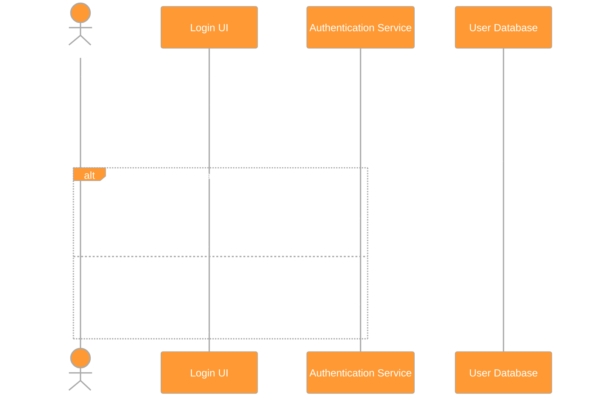
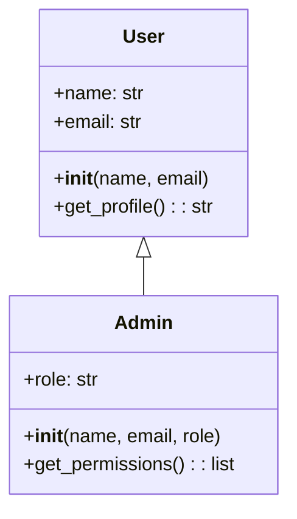

# MCP Mermaid Diagram Server

This MCP server provides tools for generating, analyzing, and modifying [Mermaid](https://mermaid.js.org/) diagrams using natural language instructions. Mermaid is a markdown-based diagramming and charting tool that renders text definitions into diagrams.

## Features

- **Generate Mermaid diagrams** from natural language descriptions
- **Analyze existing diagrams** for clarity, structure, and improvement opportunities
- **Modify diagrams** based on natural language instructions
- **Apply beautiful styling** with preset themes (default, dark, pastel, vibrant)
- **Create custom themes** to match your brand or preferences
- **Generate SVG previews** of diagrams for embedding in documents
- **Validate diagrams** to ensure they follow proper Mermaid syntax
- **Advanced orchestration** with code analysis and class diagram generation (with orchestrator version)

## Server Variants

This package provides two MCP server variants:

1. **Standard Server**: Core Mermaid diagram generation and manipulation functionality
2. **Orchestrator Server**: Enhanced version that includes code analysis and SOLID principle evaluation

## Installation

### Using pip

```bash
pip install mcp-mermaid-server
```

### Using uvx

```bash
uvx mcp-server-mermaid
```

### From source

```bash
git clone https://github.com/sparesparrow/mcp-servers.git
cd mcp-servers
pip install -e .
```

## Usage

### Running the server

You can run the standard server directly:

```bash
python -m src.mermaid.mermaid_server
```

Or run the orchestrator version with additional capabilities:

```bash
python -m src.mermaid.mermaid_orchestrator
```

### Environment Variables

- `ANTHROPIC_API_KEY`: Your Anthropic API key (required)
- `CACHE_TTL`: Cache time-to-live in seconds (default: 3600)
- `CALLS_PER_MINUTE`: Rate limit for API calls (default: 25)
- `DEFAULT_THEME`: Default color theme (default: "default")
- `CUSTOM_THEMES_PATH`: Path to JSON file containing custom themes (default: "~/.mermaid_themes.json")
- `ORCHESTRATOR_CALLS_PER_MINUTE`: Rate limit for orchestrator API calls (default: 15, orchestrator only)
- `SERVER_TYPE`: When using Docker, set to "standard" or "orchestrator" (default: "standard")

## Tools

### Standard Server Tools

#### generate_diagram

Generates a Mermaid diagram from a text description with optional styling.

```json
{
  "tool": "generate_diagram",
  "params": {
    "query": "Create a flowchart showing user authentication with registration, login, and logout steps",
    "theme": "pastel"
  }
}
```

Available themes: `default`, `dark`, `pastel`, `vibrant`, and any custom themes you've created

#### analyze_diagram

Analyzes a Mermaid diagram and provides insights.

```json
{
  "tool": "analyze_diagram",
  "params": {
    "diagram": "graph TD\nA[Start] --> B[Process]\nB --> C[End]"
  }
}
```

#### modify_diagram

Modifies an existing Mermaid diagram based on instructions.

```json
{
  "tool": "modify_diagram",
  "params": {
    "diagram": "graph TD\nA[Start] --> B[Process]\nB --> C[End]",
    "modification": "Add an alternative path from Process to a new node called Alternative",
    "theme": "vibrant",
    "keep_styling": false
  }
}
```

Parameters:
- `diagram`: The original Mermaid diagram code
- `modification`: Description of changes to make
- `theme`: Optional color theme to apply
- `keep_styling`: Whether to preserve existing styling (default: true)

#### preview_diagram

Generates an SVG preview of a Mermaid diagram.

```json
{
  "tool": "preview_diagram",
  "params": {
    "diagram": "graph TD\nA[Start] --> B[Process]\nB --> C[End]",
    "theme": "dark"
  }
}
```

Returns a base64-encoded SVG string that can be embedded in HTML or Markdown:

```html

```

#### validate_diagram

Validates Mermaid diagram syntax.

```json
{
  "tool": "validate_diagram",
  "params": {
    "diagram": "graph TD\nA[Start] --> B[Process]\nB --> C[End]"
  }
}
```

#### add_custom_theme

Adds a new custom color theme.

```json
{
  "tool": "add_custom_theme",
  "params": {
    "name": "my-brand-theme",
    "colors": {
      "node_fill": "#f5f5f5",
      "node_border": "#999999",
      "node_text": "#444444",
      "edge": "#888888",
      "highlight": "#ff9900",
      "success": "#99cc99",
      "warning": "#ffdd99",
      "error": "#ff9999"
    }
  }
}
```

Required color keys:
- `node_fill`: Background color for nodes
- `node_border`: Border color for nodes
- `node_text`: Text color for nodes
- `edge`: Color for connections between nodes
- `highlight`: Color for emphasized elements
- `success`: Color for success states
- `warning`: Color for warning states
- `error`: Color for error states

All colors must be valid hex codes (#RRGGBB or #RGB).

#### remove_custom_theme

Removes a custom color theme.

```json
{
  "tool": "remove_custom_theme",
  "params": {
    "name": "my-brand-theme"
  }
}
```

Note: Built-in themes (default, dark, pastel, vibrant) cannot be removed.

#### get_theme_info

Gets information about available color themes.

```json
{
  "tool": "get_theme_info",
  "params": {
    "theme_name": "dark"
  }
}
```

#### clear_cache

Clears the server's response cache.

```json
{
  "tool": "clear_cache",
  "params": {}
}
```

#### get_status

Gets the current server status.

```json
{
  "tool": "get_status",
  "params": {}
}
```

### Orchestrator Server Tools

In addition to all standard tools, the orchestrator server provides these additional tools:

#### analyze_and_visualize

Analyzes code against SOLID principles and generates a diagram from the results.

```json
{
  "tool": "analyze_and_visualize",
  "params": {
    "code": "class User { ... }",
    "principles": ["SingleResponsibility", "OpenClosed"]
  }
}
```

Parameters:
- `code`: Code to analyze
- `principles`: Optional list of specific principles to check

#### generate_class_diagram

Generates a class diagram from code.

```json
{
  "tool": "generate_class_diagram",
  "params": {
    "code": "class User { ... }"
  }
}
```

#### create_documentation

Creates comprehensive documentation for code with analysis and diagrams.

```json
{
  "tool": "create_documentation",
  "params": {
    "code": "class User { ... }"
  }
}
```

## Color Themes

The Mermaid server supports several built-in color themes and allows you to create custom themes:

### Built-in Themes

- **Default Theme**: A clean, professional theme with light backgrounds and subtle colors.
- **Dark Theme**: Dark backgrounds with high-contrast text for low-light environments.
- **Pastel Theme**: Soft, pastel colors for a gentle visual experience.
- **Vibrant Theme**: Bright, energetic colors for emphasis and visual impact.

### Custom Themes

Custom themes are stored in a JSON file (default location: `~/.mermaid_themes.json`) and can be created or removed using the `add_custom_theme` and `remove_custom_theme` tools. 

Example custom theme:
```json
{
  "my-brand-theme": {
    "node_fill": "#f5f5f5",
    "node_border": "#999999",
    "node_text": "#444444",
    "edge": "#888888",
    "highlight": "#ff9900",
    "success": "#99cc99",
    "warning": "#ffdd99",
    "error": "#ff9999"
  }
}
```

## Integration with Claude Desktop

To use the standard server with Claude Desktop, add the following to your `.claude-config.json` file:

```json
{
  "mcpServers": {
    "mermaid-generator": {
      "command": "python",
      "args": ["-m", "src.mermaid.mermaid_server"],
      "env": {
        "ANTHROPIC_API_KEY": "${ANTHROPIC_API_KEY}",
        "DEFAULT_THEME": "pastel",
        "CUSTOM_THEMES_PATH": "${HOME}/.mermaid_themes.json"
      }
    }
  }
}
```

To use the orchestrator server instead:

```json
{
  "mcpServers": {
    "mermaid-orchestrator": {
      "command": "python",
      "args": ["-m", "src.mermaid.mermaid_orchestrator"],
      "env": {
        "ANTHROPIC_API_KEY": "${ANTHROPIC_API_KEY}",
        "DEFAULT_THEME": "pastel",
        "CUSTOM_THEMES_PATH": "${HOME}/.mermaid_themes.json"
      }
    }
  }
}
```

Alternatively, using Docker:

```json
{
  "mcpServers": {
    "mermaid-generator": {
      "command": "docker",
      "args": ["run", "-i", "--rm", "-e", "SERVER_TYPE=standard", "mcp-mermaid-server"],
      "env": {
        "ANTHROPIC_API_KEY": "${ANTHROPIC_API_KEY}",
        "DEFAULT_THEME": "pastel"
      },
      "volumes": [
        "${HOME}/.mermaid_themes.json:/root/.mermaid_themes.json"
      ]
    }
  }
}
```

## Example Conversations

### Generating a Diagram

**User**: "Create a sequence diagram showing how a user interacts with a login system"

**Claude**: "I'll create a sequence diagram for a login system with a dark theme. Let me use the Mermaid diagram generator."

*Claude uses the generate_diagram tool with the 'dark' theme*

**Claude**: "Here's a sequence diagram showing a user's interaction with a login system:



This diagram shows:
1. The user entering credentials in the UI
2. The UI submitting those credentials to the authentication service
3. The authentication service validating against the user database
4. Different paths for successful vs. failed authentication"

### Creating a Custom Theme

**User**: "I want to create a custom theme for my brand with blue as the primary color"

**Claude**: "I'll help you create a custom theme for your brand. Let me use the Mermaid tools to do that."

*Claude uses the add_custom_theme tool*

**Claude**: "I've created a custom theme called 'brand-blue' with your brand's color scheme. You can now use this theme when generating diagrams by specifying `theme: 'brand-blue'`. Here's a preview of what a diagram would look like with your new theme:


You can use this theme for all your future diagrams, and it will be saved for future sessions as well."

### Analyzing Code with the Orchestrator (Orchestrator Only)

**User**: "Can you generate a class diagram for this code?"

```python
class User:
    def __init__(self, name, email):
        self.name = name
        self.email = email
        
    def get_profile(self):
        return f"{self.name} <{self.email}>"

class Admin(User):
    def __init__(self, name, email, role):
        super().__init__(name, email)
        self.role = role
        
    def get_permissions(self):
        return ["read", "write", "admin"]
```

**Claude**: "I'll generate a class diagram for your code."

*Claude uses the generate_class_diagram tool*

**Claude**: "Here's a class diagram representing your code:



This diagram shows the inheritance relationship between the User and Admin classes, along with their respective attributes and methods."

## Testing

Run the tests with pytest:

```bash
pytest tests/test_mermaid_server.py
```

Or run end-to-end tests:

```bash
# Test standard server
python -m src.mermaid.e2e_test --server-type standard

# Test orchestrator server
python -m src.mermaid.e2e_test --server-type orchestrator
```

## Docker

Build and run the Docker container:

```bash
docker build -t mcp-mermaid-server -f Dockerfile.mermaid .

# Run standard server
docker run -i --rm \
  -e ANTHROPIC_API_KEY=your_api_key \
  -e DEFAULT_THEME=vibrant \
  -e SERVER_TYPE=standard \
  -v ~/.mermaid_themes.json:/root/.mermaid_themes.json \
  mcp-mermaid-server

# Run orchestrator server
docker run -i --rm \
  -e ANTHROPIC_API_KEY=your_api_key \
  -e DEFAULT_THEME=vibrant \
  -e SERVER_TYPE=orchestrator \
  -v ~/.mermaid_themes.json:/root/.mermaid_themes.json \
  mcp-mermaid-server
```

## License

MIT 