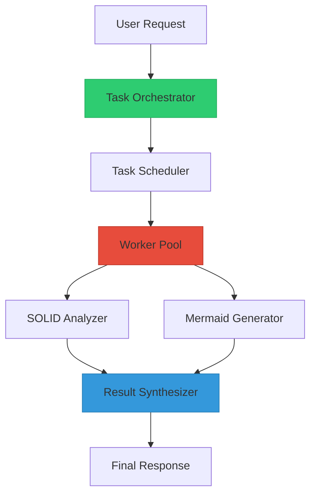
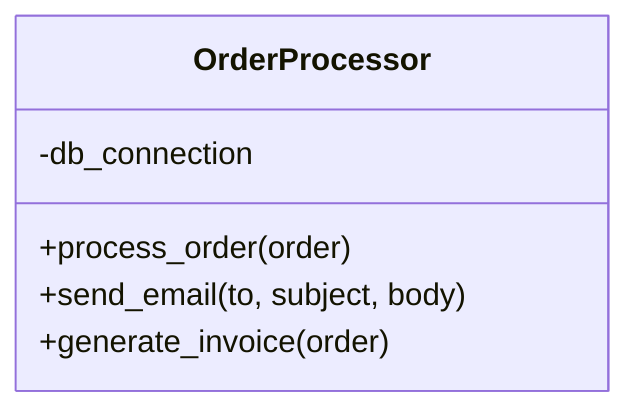
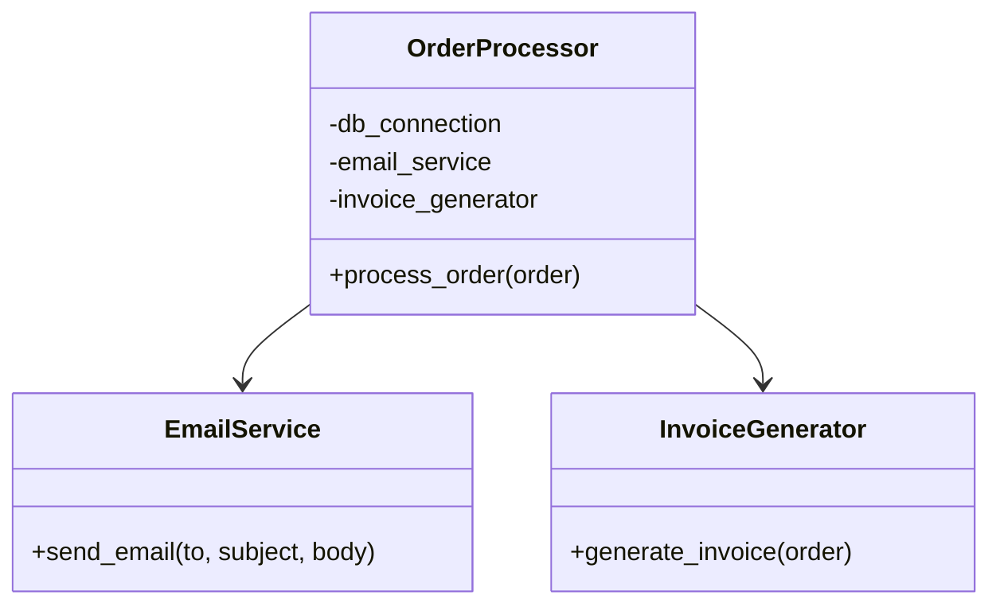

# Code Diagram Orchestrator

This MCP server implements the Orchestrator-Workers pattern to coordinate between the SOLID analyzer and Mermaid diagram generator servers, enabling advanced integration scenarios.

## Architecture

The orchestrator follows a structured workflow:

1. **Task Decomposition**: Break complex tasks into subtasks assigned to worker servers
2. **Worker Assignment**: Assign subtasks to appropriate specialized workers 
3. **Task Execution**: Execute tasks in the correct order respecting dependencies
4. **Result Synthesis**: Combine results from workers into a cohesive final result



## Features

- **Dependency Management**: Handles task dependencies automatically
- **Parallel Execution**: Executes independent tasks in parallel where possible
- **Error Handling**: Robust error handling for each step of the process
- **Caching**: Efficient caching of results to improve performance
- **Rate Limiting**: Intelligent rate limiting to prevent API quota issues

## Tools

### analyze_and_visualize

Analyze code for SOLID principles and generate a diagram from the results.

```json
{
  "tool": "analyze_and_visualize",
  "params": {
    "code": "class UserManager:\n  def __init__(self, db):\n    self.db = db\n  def create_user(self, username):\n    self.db.save('users', username)",
    "principles": ["Single Responsibility Principle", "Open/Closed Principle"]
  }
}
```

Response:
```json
{
  "analysis": "Analysis of SOLID principles...",
  "diagram": "classDiagram\n  class UserManager {\n    +create_user(username)\n  }"
}
```

### generate_class_diagram

Generate a class diagram from code.

```json
{
  "tool": "generate_class_diagram",
  "params": {
    "code": "class UserManager:\n  def __init__(self, db):\n    self.db = db\n  def create_user(self, username):\n    self.db.save('users', username)"
  }
}
```

### create_documentation

Create comprehensive documentation for code with analysis and diagrams.

```json
{
  "tool": "create_documentation",
  "params": {
    "code": "class UserManager:\n  def __init__(self, db):\n    self.db = db\n  def create_user(self, username):\n    self.db.save('users', username)"
  }
}
```

## Requirements

The orchestrator requires both the SOLID server and Mermaid server to be accessible. In production, you'd typically run all three servers:

1. SOLID server for code analysis
2. Mermaid server for diagram generation
3. Orchestrator server for coordination between them

## Installation

### Using pip

```bash
pip install -e .
```

## Running the Orchestrator

Start the orchestrator with:

```bash
python -m src.orchestrator.code_diagram_orchestrator
```

### Environment Variables

The orchestrator accepts the following environment variables:

- `ANTHROPIC_API_KEY`: Your Anthropic API key (required)
- `CACHE_TTL_SECONDS`: Cache time-to-live in seconds (default: 3600)
- `CALLS_PER_MINUTE`: API rate limit (default: 15)

## Running with Docker

### Individual Container

```bash
docker build -t mcp-orchestrator -f Dockerfile.orchestrator .
docker run -i --rm -e ANTHROPIC_API_KEY=your_api_key mcp-orchestrator
```

### Using Docker Compose

To run all servers together:

```bash
docker-compose up
```

To run just the individual servers (without the unified server):

```bash
docker-compose --profile individual up
```

## Integration with Claude Desktop

Add the following to your `.claude-config.json` file:

```json
{
  "mcpServers": {
    "code-diagram-orchestrator": {
      "command": "python",
      "args": ["-m", "src.orchestrator.code_diagram_orchestrator"],
      "env": {
        "ANTHROPIC_API_KEY": "${ANTHROPIC_API_KEY}"
      }
    }
  }
}
```

## Example Conversations

### Analyzing and Visualizing Code

**User**: "Analyze this class and create a diagram:

```python
class OrderProcessor:
    def __init__(self, db_connection):
        self.db = db_connection
    
    def process_order(self, order):
        # Save to database
        self.db.save('orders', order)
        
        # Send confirmation email
        self.send_email(order['email'], 'Order Confirmation', 'Your order has been processed')
        
        # Generate invoice PDF
        self.generate_invoice(order)
        
    def send_email(self, to, subject, body):
        # Code to send email
        print(f"Sending email to {to}")
        
    def generate_invoice(self, order):
        # Code to generate PDF
        print(f"Generating invoice for order {order['id']}")
```"

**Claude**: "I'll analyze this code for SOLID principles and create a diagram to visualize its structure."

*Claude uses the analyze_and_visualize tool*

**Claude**: "Here's my analysis of the OrderProcessor class:

## SOLID Analysis

### Single Responsibility Principle (SRP) - Violation
This class has multiple responsibilities:
1. Processing orders (database operations)
2. Sending emails
3. Generating invoices

Each of these should be handled by separate classes.

### Open/Closed Principle (OCP) - Violation
The class would need to be modified directly to add new order processing steps rather than being extended.

### Diagram



### Recommended Refactoring



This refactoring separates responsibilities into specialized classes, adhering to the Single Responsibility Principle."

## Testing

Run the tests with pytest:

```bash
pytest tests/test_orchestrator.py
```

## License

MIT 